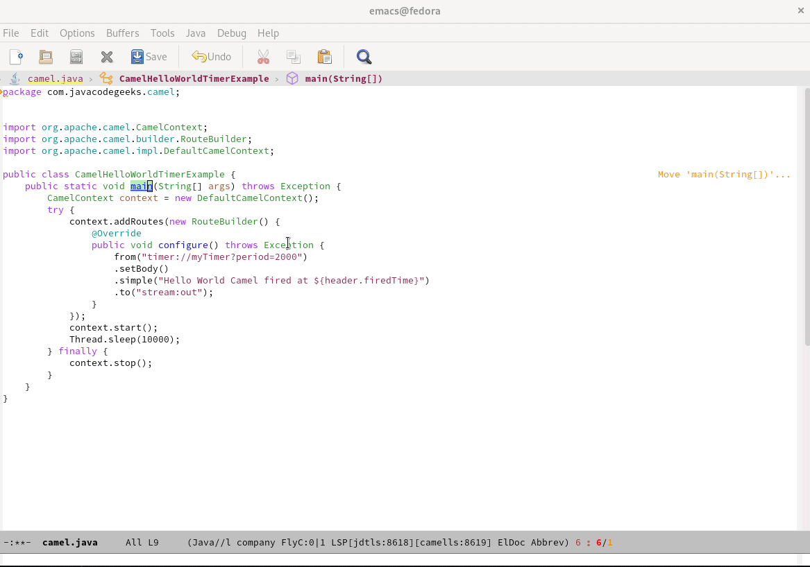

## This is a client implementation of the Apache Camel Language Server Protocol for Emacs

Link for Apache Camel Language Server


# Text Editing capabilities of Camel URI with Camel XML DSL

For instance, code completion for Camel XML Dsl. The capabilities are based on the [Camel Language Server](https://github.com/camel-tooling/camel-language-server/).


# Text Editing capabilities of Camel URI with Camel JAVA DSL

For instance, code completion for Camel Java Dsl. The capabilities are based on the [Camel Language Server](https://github.com/camel-tooling/camel-language-server/).




## Prerequisites
Java 11+ is required to be present on the System Path

# How to configure Emacs

In a `~/.emacs.d/init.el` file:

```lisp
(require 'package)
(add-to-list 'package-archives '("melpa" . "https://melpa.org/packages/") t)
;; Comment/uncomment this line to enable MELPA Stable if desired.  See `package-archive-priorities`
;; and `package-pinned-packages`. Most users will not need or want to do this.
;;(add-to-list 'package-archives '("melpa-stable" . "https://stable.melpa.org/packages/") t)
(package-initialize)
(custom-set-variables
 ;; custom-set-variables was added by Custom.
 ;; If you edit it by hand, you could mess it up, so be careful.
 ;; Your init file should contain only one such instance.
 ;; If there is more than one, they won't work right.
 '(package-selected-packages '(lsp-mode)))
(custom-set-faces
 ;; custom-set-faces was added by Custom.
 ;; If you edit it by hand, you could mess it up, so be careful.
 ;; Your init file should contain only one such instance.
 ;; If there is more than one, they won't work right.
 )
(require 'lsp-mode)
(add-hook 'nxml-mode-hook #'lsp)
(require 'lsp-mode)
(add-hook 'java-mode-hook #'lsp)
```

In a `~/.emacs.d/lsp-camel.el` file:

```lisp
;;; lsp-camel.el --- LSP Camel server integration        -*- lexical-binding: t; -*-
;;; Code:
(require 'lsp-mode)
(defgroup lsp-camel nil
 "LSP support for Camel, using camel-language-server"
 :group 'lsp-mode
 :tag "Language Server"
 :package-version '(lsp-mode . "8.0.0"))
;; Define a variable to store camel language server jar version
(defconst lsp-camel-jar-version "1.5.0")
;; Define a variable to store camel language server jar name
(defconst lsp-camel-jar-name (format "camel-lsp-server-%s.jar" lsp-camel-jar-version))
;; Directory in which the servers will be installed. Lsp Server Install Dir: ~/.emacs.d/.cache/camells
(defcustom lsp-camel-jar-file (f-join lsp-server-install-dir "camells" lsp-camel-jar-name)
 "Camel Language server jar command."
 :type 'string
 :group 'lsp-camel
 :type 'file
 :package-version '(lsp-mode . "8.0.0"))
(defcustom lsp-camel-jar-download-url
 (format "https://repo1.maven.org/maven2/com/github/camel-tooling/camel-lsp-server/%s/%s" lsp-camel-jar-version lsp-camel-jar-name)
 "Automatic download url for lsp-camel."
 :type 'string
 :group 'lsp-camel
 :package-version '(lsp-mode . "8.0.0"))
(lsp-dependency
'camells
'(:system lsp-camel-jar-file)
`(:download :url lsp-camel-jar-download-url
			:store-path lsp-camel-jar-file))
(defcustom lsp-camel-server-command `("java" "-jar" , lsp-camel-jar-file)
 "Camel server command."
 :type '(repeat string)
 :group 'lsp-camel
 :package-version '(lsp-mode . "8.0.0"))
(defun lsp-camel--create-connection ()
 (lsp-stdio-connection
  (lambda () lsp-camel-server-command)
  (lambda () (f-exists? lsp-camel-jar-file))))
(lsp-register-client
(make-lsp-client :new-connection (lsp-camel--create-connection)
				 :activation-fn (lsp-activate-on "xml" "java")
				 :priority 0
				 :server-id 'camells
				 :add-on? t
				 :multi-root t
				 :initialized-fn (lambda (workspace)
								   (with-lsp-workspace workspace
									 (lsp--set-configuration (lsp-configuration-section "camel"))))
				 :download-server-fn (lambda (_client callback error-callback _update?)
									   (lsp-package-ensure 'camells callback error-callback))))
(lsp-consistency-check lsp-camel)
(provide 'lsp-camel)
;;; lsp-camel.el ends here
```
Opening the `lsp-camel.el` file

Evaluating it by calling `M-x eval-buffer`

Loading Camel LS by calling: `M-x lsp-install-server` and choosing `camells`

Opening a `camel.xml` file with this kind of content:

```xml
<?xml version="1.0" encoding="UTF-8"?>
<beans xmlns="http://www.springframework.org/schema/beans"
	   xmlns:xsi="http://www.w3.org/2001/XMLSchema-instance"
	   xsi:schemaLocation="
	   http://www.springframework.org/schema/beans https://www.springframework.org/schema/beans/spring-beans.xsd
	   http://camel.apache.org/schema/spring https://camel.apache.org/schema/spring/camel-spring.xsd">

  <camelContext id="camel" xmlns="http://camel.apache.org/schema/spring">
	<route id="a route">
	  <from uri="timer:timerName?delay=1000&amp;exchangePattern=InvalidEnumValue"/>
	  <to uri="direct:drink"/>
	</route>
  </camelContext>
</beans>
```
Opening a `camel.java` file with this kind of content:

```java
package com.javacodegeeks.camel;
import org.apache.camel.CamelContext;
import org.apache.camel.builder.RouteBuilder;
import org.apache.camel.impl.DefaultCamelContext;
public class CamelHelloWorldTimerExample {
    public static void main(String[] args) throws Exception {
        CamelContext context = new DefaultCamelContext();
        try {
            context.addRoutes(new RouteBuilder() {
                @Override
                public void configure() throws Exception {
                    from("timer://myTimer?period=2000")
                    .setBody()
                    .simple("Hello World Camel fired at ${header.firedTime}")
                    .to("stream:out");
                }
            });
            context.start();
            Thread.sleep(10000);
        } finally {
            context.stop();
        }
    }
}
```

Then you can enjoy editing capabilities of Camel URI. For instance by calling completion with Ctrl+Alt+i in the uri attribute value.
